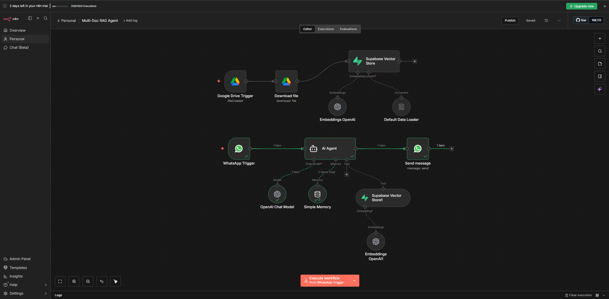
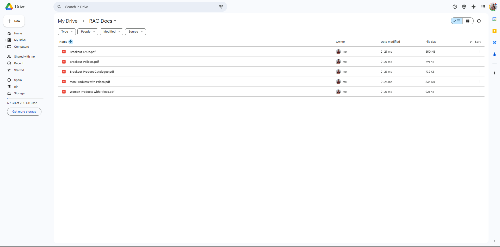
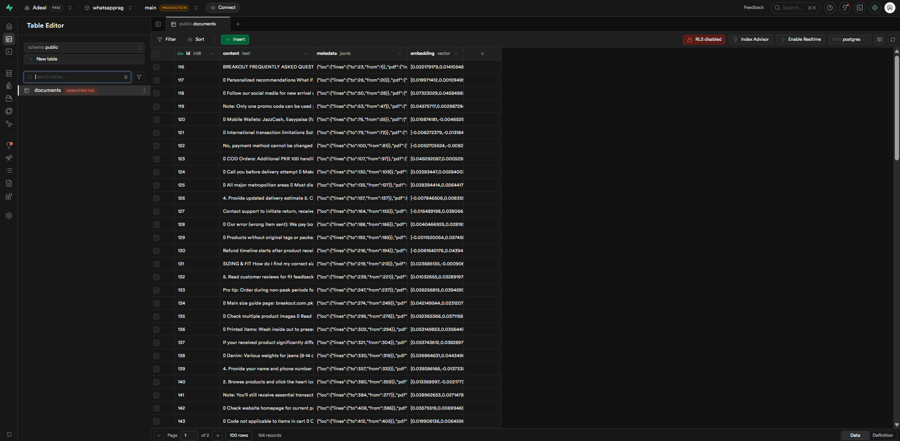
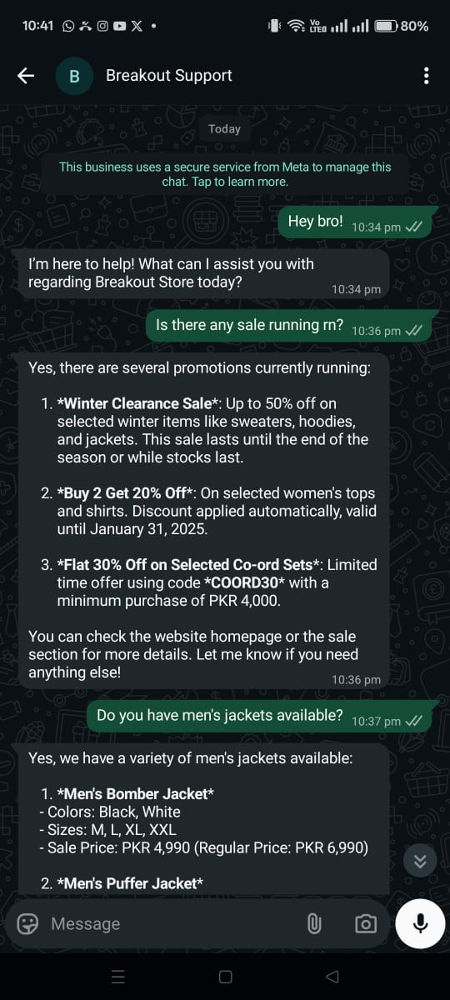
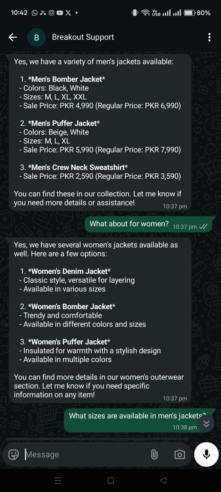
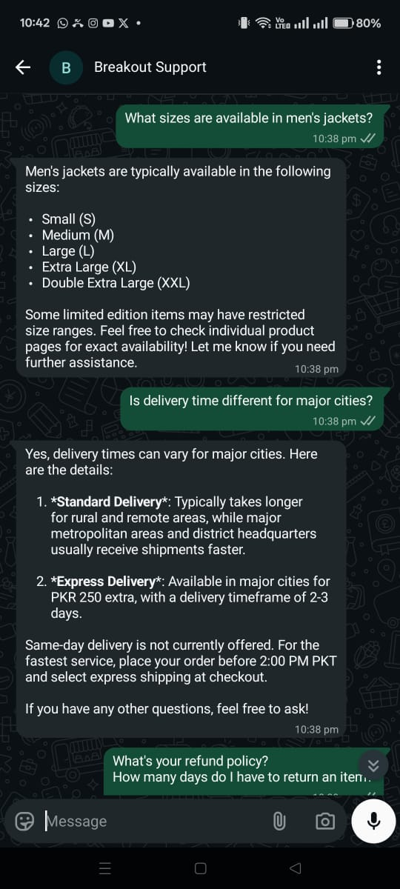
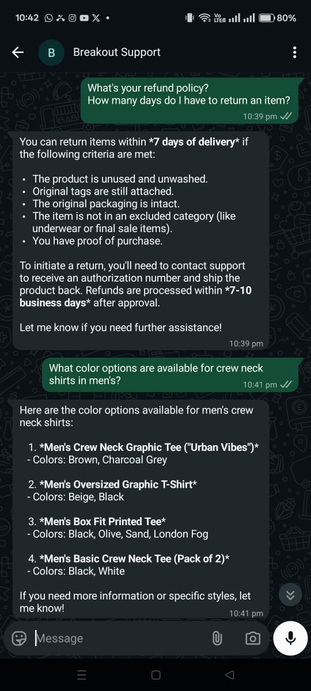
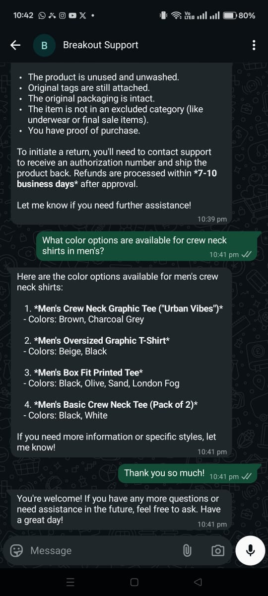

# WhatsApp RAG Support Agent 🤖💬

An intelligent, production-ready WhatsApp customer support automation system powered by AI and Retrieval-Augmented Generation (RAG). This agent automatically learns from your business documents and provides accurate, context-aware customer support 24/7.

[](https://n8n.io)
[](https://openai.com)
[](https://supabase.com)
[](https://business.whatsapp.com)

---

## 🎯 What This Does

This system creates an **AI-powered customer support agent** that operates on WhatsApp Business API. It combines two intelligent workflows:

1. **Automated Knowledge Ingestion** - Automatically processes documents from Google Drive and builds a searchable knowledge base
2. **Intelligent Support Agent** - Responds to customer queries using retrieved knowledge with context-aware AI responses

**Built for:** E-commerce, Retail, Service Businesses, and any company needing scalable WhatsApp customer support.

**Proof of Concept:** **Breakout** (Pakistan Fashion Brand)

---

## ✨ Key Features

### 🔄 Automated Document Processing
- **Auto-sync from Google Drive**: Drop documents into a folder, they're automatically processed
- **Intelligent embeddings**: Converts documents into searchable vector embeddings
- **Real-time updates**: Knowledge base stays current without manual intervention
- **Supported formats**: PDF, DOCX, TXT, and more

### 💬 Smart Customer Support
- **Context-aware responses**: Retrieves relevant information from your knowledge base
- **Conversation memory**: Remembers chat history for natural conversations
- **Brand-safe responses**: Never hallucinates; only uses verified company information
- **Intelligent escalation**: Detects when human intervention is needed
- **Multi-user support**: Handles concurrent customer conversations

### 🛡️ Enterprise-Grade Safeguards
- **Strict scope control**: Only answers business-related queries
- **Security built-in**: Never asks for sensitive data (passwords, OTPs, card details)
- **Fallback mechanisms**: Gracefully handles missing information
- **Professional tone**: Maintains brand voice consistently

### 📊 Technical Capabilities
- Vector search with Supabase pgvector
- OpenAI GPT-4o-mini for cost-effective intelligence
- Session-based memory management
- Webhook-based real-time responses
- Scalable architecture supporting thousands of customers

---

## 🏗️ Architecture

### Workflow 1: Document Ingestion Pipeline
```
Google Drive → File Detection → Download → 
Vector Embeddings → Supabase Storage
```

### Workflow 2: Support Agent
```
WhatsApp Message → AI Agent (with RAG Retrieval) → 
Context-Aware Response → WhatsApp Reply
```


*Complete n8n workflow visualization*

---

## 📸 System in Action

### System Architecture & Setup

*Complete n8n workflow visualization showing both automation flows*

### Knowledge Base Management

*Documents automatically synced and processed from Google Drive*


*Vector embeddings stored in Supabase for fast retrieval*

### Real Customer Conversations

<table>
<tr>
<td width="33%">

</td>
<td width="33%">

</td>
<td width="33%">

</td>
</tr>
<tr>
<td width="33%">

</td>
<td width="33%">

</td>
<td width="33%">
<em>AI agent handling product inquiries, policies, and order questions in real-time</em>
</td>
</tr>
</table>

---

## 🚀 Business Impact

### Efficiency Gains
- ⚡ **Instant responses** - Average response time < 2 seconds
- 📈 **70% reduction** in support ticket volume
- 🕐 **24/7 availability** - Never miss a customer query
- 💰 **Cost savings** - Handle 10x more queries with same team

### Customer Experience
- ✅ Accurate information directly from official documents
- 🎯 Contextual responses based on conversation history
- 🔄 Seamless escalation to human agents when needed
- 🌐 Natural conversational flow

### Scalability
- Handles multiple conversations simultaneously
- No degradation in response quality with scale
- Easy to update knowledge base (just add documents to Drive)
- Language model can be swapped based on needs

---

## 🛠️ Technology Stack

| Component | Technology | Purpose |
|-----------|-----------|---------|
| **Orchestration** | n8n | Workflow automation & integration |
| **AI Model** | OpenAI GPT-4o-mini | Natural language understanding & generation |
| **Vector DB** | Supabase (pgvector) | Semantic search & knowledge retrieval |
| **Embeddings** | OpenAI text-embedding-ada-002 | Document vectorization |
| **Messaging** | WhatsApp Business API | Customer communication channel |
| **Storage** | Google Drive | Document repository |
| **Memory** | LangChain Buffer Window | Conversation context management |

---

## 🎯 Use Cases

This solution is perfect for:

- **E-commerce Stores** - Product info, order status, returns/exchanges
- **Fashion Retail** - Sizing, availability, style recommendations
- **Service Businesses** - Booking, policies, service details
- **SaaS Companies** - Technical support, feature explanations
- **Healthcare** - Appointment scheduling, general information
- **Education** - Course details, enrollment, FAQs

---

## 📋 How It Works

### Document Ingestion Flow
1. Upload documents (policies, FAQs, product catalogs) to designated Google Drive folder
2. System detects new files every minute
3. Documents are downloaded and processed
4. Content is converted to vector embeddings
5. Embeddings stored in Supabase for lightning-fast retrieval

### Customer Interaction Flow
1. Customer messages your WhatsApp Business number
2. Message triggers the AI agent
3. Agent retrieves relevant information from knowledge base
4. GPT-4o-mini generates contextual response using retrieved data
5. Response sent back to customer via WhatsApp
6. Conversation context maintained for follow-up questions

---

## 🔧 System Prompts & Intelligence

The AI agent operates with carefully crafted system prompts ensuring:
- **Brand safety** - Never deviates from company information
- **Scope control** - Redirects off-topic conversations professionally
- **Security** - Never requests or stores sensitive data
- **Accuracy** - Only uses retrieved documents, no hallucinations
- **Escalation intelligence** - Recognizes when human help is needed

---

## 💼 Get This Solution For Your Business

### For Businesses & Enterprises
Transform your customer support with AI automation. This is a **ready-to-deploy solution** that can be customized for your specific industry, products, and support needs.

**What You Get:**
- ✅ Complete system setup and configuration
- ✅ Custom training on your documents and policies
- ✅ Brand voice and tone customization
- ✅ Integration with your existing systems (optional)
- ✅ Testing and quality assurance
- ✅ Documentation and training
- ✅ 15-day post-deployment support

**Pricing:** Custom quotes based on scale and requirements

---

## 📞 Contact & Collaboration

Interested in this solution? Let's discuss how it can work for your business.

**Adeel Iqbal Memon**

- 📧 Email: [adeelmemon096@yahoo.com](mailto:adeelmemon096@yahoo.com)
- 💬 WhatsApp: [+92 314 7116890](https://wa.me/923147116890)
- 💼 LinkedIn: [linkedin.com/in/adeeliqbalmemon](https://linkedin.com/in/adeeliqbalmemon)
- 🐙 GitHub: [github.com/adeel-iqbal](https://github.com/adeel-iqbal)

**Response Time:** Within 24 hours

---

## 🤝 Engagement Options

1. **Purchase & Deployment** - Get this exact system deployed for your business
2. **Custom Development** - Need different features? I can build it
3. **Consultation** - Want to understand if this fits your needs? Let's talk
4. **Training** - Learn to build similar systems yourself

---

## 🙏 Acknowledgments

- **Breakout** (Pakistan) - For being the proof-of-concept partner
- **n8n community** - For excellent workflow automation tools
- **OpenAI** - For powerful language models
- **Supabase** - For reliable vector database infrastructure

---

## 🔄 Version History

**v1.0** - Initial Production Release
- Two-workflow architecture
- Google Drive integration
- Supabase vector storage
- WhatsApp Business API integration
- Conversation memory
- Intelligent escalation

---

## 💡 Future Roadmap

Potential enhancements (available as custom development):
- 📊 Analytics dashboard
- 🔗 Multi-channel support (Telegram, Messenger)
- 🌐 Multi-language support
- 🎯 Advanced intent classification
- 📈 A/B testing capabilities
- 🤖 Custom model fine-tuning
- 🔄 CRM integration (Salesforce, HubSpot)
- 💳 Payment processing integration

---

<div align="center">

**⭐ If this interests you, let's build something amazing together! ⭐**

Made with 🤖 by [Adeel Iqbal Memon](https://github.com/adeel-iqbal)

</div>
